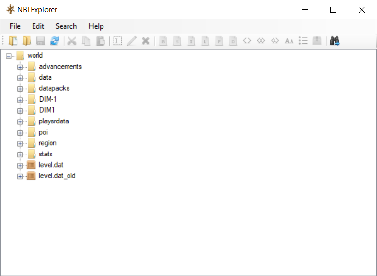
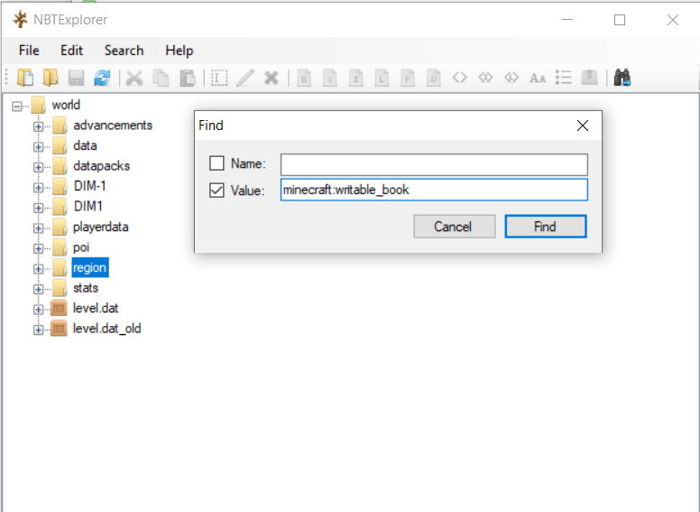
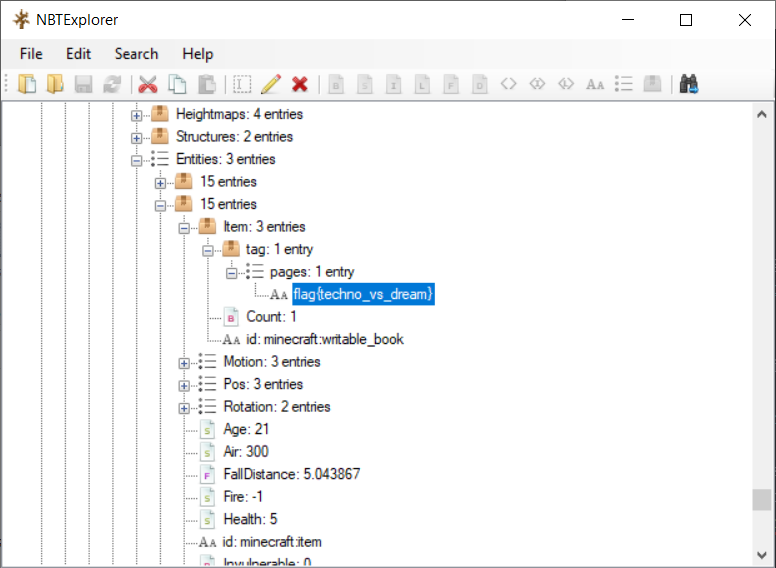

# big world

### Challenge
Someone took my gold and a secret book with the flag! Can you help me find it?  
[world.zip](world.zip)

### Solution
world.zip is a Minecraft world folder. I used [NBTExplorer](https://github.com/jaquadro/NBTExplorer/releases), a Minecraft world editor to look inside it.

The challenge description mentions a secret book. All overworld chunk data in Minecraft is stored in the region folder of the world folder, so the secret book is most likely to be in this folder. I used the find feature of NBTExplorer and entered in the item id of a book: `minecraft:writable_book` and searched inside of the region folder.

It takes a while to search but inside the book, there is the flag.

### Flag
`flag{techno_vs_dream}`
