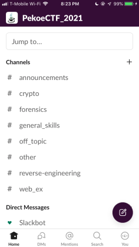
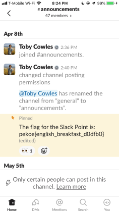
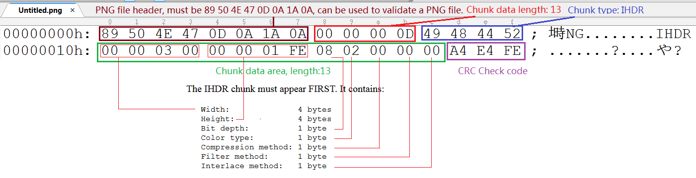
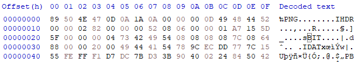
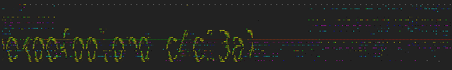
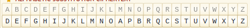
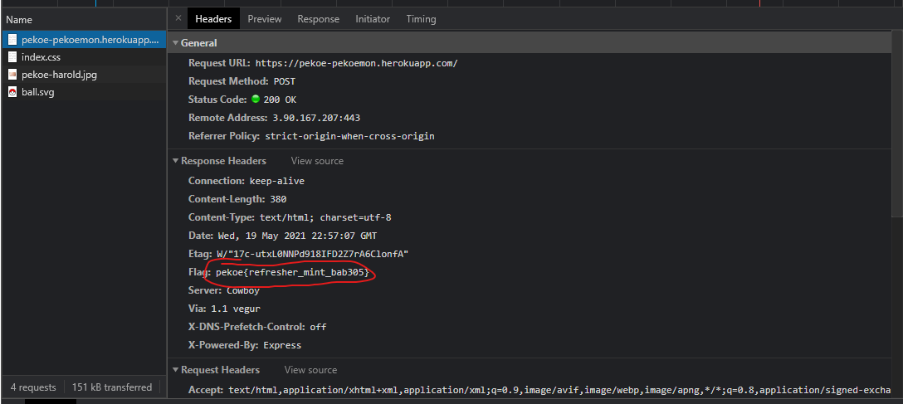

# General Skills
## The Slack Point
The description of slack point says `Join our slack to form teams, hangout, and maybe even get some hints` and a link to https://join.slack.com/t/pekoectf2021/shared_invite/zt-oslt5t6r-j31rFL~b4ZHXPOnfZjEWlA
This seems to be one of the common types of problems in CTF, where the problem directs the users to some sort of communication platform in case they did not join yet, and also familiarizes new players with the flag finding process and flag input.
The hint says `HEY SLACKER, WHY HAVEN'T YOU DONE THIS ALREADY?`, which isn’t very helpful.
After joining the slack, we see:



The flag is likely hidden in one of the channels. Opening the first channel announcement shows the flag in a message at the top:



Inputting the flag into the problem gives us one point :)))
## Glass
Binwalk it and you get the flag
## Fruit
Binwalk it and you get the flag
## Not a Nintendo64
The file contains 
`RGVhciBOZXBoZXcsIApJIHdpbGwgbm90IGdpdmUgeW91IGEgTmludGVuZG82NCwgaG93ZXZlciBJIHdpbGwgZ2l2ZSB5b3UgYSBmbGFnIGluIGJhc2U2NC4gCkhlcmUgaXQgaXM6IHBla29le2VhcmxfZ3JleV81NGQ1MjB9ClNpbmNlcmVseQpVbmNsZSBQZWtvZSAK`

Converting from base64 to ASCII gives us the message:

```
Dear Nephew, 
I will not give you a Nintendo64, however I will give you a flag in base64. 
Here it is: pekoe{earl_grey_54d520}
Sincerely
Uncle Pekoe 
```

## Making hash browns?
Hash the text using MD5.

## Rolling, rolling on a CTF
Find the link that isn’t a rickroll with find and replace. Flag is in description.

## Tar and feather
I extracted all of the tar.gz files with this script:
```python
import tarfile
def extract(fname):
    if fname.endswith("tar.gz"):
        tar = tarfile.open(fname, "r:gz")
        tar.extractall()
        tar.close()
    elif fname.endswith("tar"):
        tar = tarfile.open(fname, "r:")
        tar.extractall()
        tar.close()

for i in range(500):
    extract(str(500-i) + ".tar.gz")
```
## normal gcode
Open the gcode file into http://jherrm.com/gcode-viewer/ to get the flag.

## The missing link
Reverse image search the picture on Google, and the link pops up.

## Captcha the flag
The way the website verifies if you solved the captcha is that it sends a post request to https://pekoe-captcha-the-flag.herokuapp.com/check-code with the text you entered in as the solved captcha and the password attempt. Every time you send a get request to https://pekoe-captcha-the-flag.herokuapp.com/, it generates a new captcha and invalidates the previously generated one. However, it doesn’t generate a new captcha when you send a post request to https://pekoe-captcha-the-flag.herokuapp.com/check-code to verify the captcha. I don’t know if this was a design flaw or if it was intended, but this can be exploited by solving the captcha once manually, and then using a script to brute force all the passwords using that one solved captcha. The captcha never gets invalidated because of the aforementioned way the website generates new captchas. I made this script and manually put in a solved captcha into it.
```python
import requests
 
for password in range(100,1000):
    url = "https://pekoe-captcha-the-flag.herokuapp.com/check-code"
    data = {“captcha”: "xxxxxx", “code”: password}
    check = requests.post(url, data).text
    if “Incorrect” not in check:
        print(password)
```

# Reverse Engineering
## Easy_Java
The problem gives you a java script and the output of it when the flag is put into it. 
I brute forced the flag by turning the script into a method and looping through numbers and if it equaled the output, then I know I have the flag.
```java
class Main {
  public static void main(String[] args) {
    for(int i = 0; i<1000000; i++){
      if(test(i)==895205){
        System.out.println(i);
      }
    }
  }
 
  public static int test(int input) {
    int temp = input;
    int output = 0;
    for (int x = 0; x < 3; x++) {
      output = temp;
      output = output / 2;
      output = output - 5;
      temp = output;
    }
 
    if (input > temp) {
      output = temp;
      output = output * 7;
      temp = output;
    }
 
    if (output == 0) {
      temp = input % 5;
      output = output + temp;
    }
 
    if (output == temp) {
      temp = input / 5;
      output = output + temp;
 
    }
    return output;
  }
}
```

This outputted:
832806
832807
832808
832809
The second one is the flag.
## Driving a Tractor
The flag is in the java code on line 15.

## Sudo random? -1
Wichmann Hill pseudorandom number generator. 3 seeds given, 5th means 5th output of three linear congruential generators. 
https://en.wikipedia.org/wiki/Wichmann%E2%80%93Hill
```python
s1 = 100
s2 = 100
s3 = 100
for i in range(5):
 s1 = (171*s1) % 30269
 s2 = (172*s2) % 30307
 s3 = (170*s3) % 30323
r =  (s1/30269.0 + s2/30307.0 + s3/30323.0)%1
print(r)
```
## Sudo random? -2
They give you the outputs of the random number generator and want you to guess the 3 seeds.
I brute forced it by testing all the permutations of seeds in the generator and comparing the first output in the file they give to the first output of the script. If they matched, it was likely the flag since it is highly improbable that two different sets of seeds have the same generated value. I generated the combinations of permutations and then did it 6 times, rotating the numbers each time to save on memory because generating permutations would have taken over 50gb of memory. This took about 5 minutes to complete because this script is not optimised and made in python. This gave the flag of `720469842`
```python
import itertools
 
def test(combinations, config):
    s1 = combinations[config[0]]
    s2 = combinations[config[1]]
    s3 = combinations[config[2]]
    s1 = (171*s1) % 30269
    s2 = (172*s2) % 30307
    s3 = (170*s3) % 30323
    if((s1/30269.0 + s2/30307.0 + s3/30323.0)%1 == 0.44973233611811203):
        print(combinations[config[0]], combinations[config[1]], combinations[config[2]])
 
combinations = list(itertools.combinations(range(100, 1000), 3))
configs = list(itertools.permutations(range(3), 3)) 
 
for config in configs: #in order to save on memory
    for combination in combinations:
        test(combination, config)
```

# Forensics
## A broken image
It looked like the image header had some bytes decapitated from the beginning of it. 
Here is the structure of a PNG header:



Using that structure, we repaired the header to this point:



We then opened the image using the windows photos app (other apps will not open this) to see:



We tried to repair it further, but all our attempts failed, so we tried to guess the tea of the flag and each of the random letters on the end of the flag based on the partial letters that were in the image.\
Some of our guessing strategies included:
- The tall curly parts looked like braces, and we assumed the part before it was pekoe
- The gap in between was most likely an underscore, since that is the format of most questions.
- With many tea based flags, we thought the first part was likely to be some sort of tea. The “o”s and the l in the middle helped us assume that the tea was oolong
- The part after the underscore looked like it definitely ended in “3a”.
- Knowing that the second half is generally six characters long, we assumed the part before “3a” was four characters long.
- This helped us determine that the two loops were “c”s
- The two unknown characters were likely numbers, and based on the slant of the first one and the top and bottom of the second, we guessed that it was 4 and 1

Putting the guesses together yielded `pekoe{oolong_c4c13a}`

## Where’s my backup?
Binwalk it and inside the ext-root folder the flag is there

## Dr.java
Binwalk it and you get the flag

## The Magic Colors
Use a color picker to get the hex values of each color from left to right and convert it to ascii for the flag.
## Noise 1
Use py-kcs http://www.dabeaz.com/py-kcs/ to get the flag

## Arduino Bitmap
The file contains an array of hex values. Converting this to bits reveals a black and white bitmap of letters that show the flag.

## The droid you are looking for
Binwalk it and the flag is in the assets folder

## Recovery Image Image Recovery
Binwalk it and the flag is in _1833000.extracted/cpio-root/flag.png

## Noise 2
The audio seemed to be a fax image over radio.
We used [Black Cat HF Weather Fax](https://www.blackcatsystems.com/software/hf_weather_fax.html) to get the flag:

# Crypto
## Ceaser0.txt
Based on the title, it seems like a caesar cipher.
The txt file contains `apvzp{nslxzxtwp_lqqnlom}`
I plug it into https://cryptii.com/pipes/caesar-cipher and try all the shifts. It turns out that the shift is 11 and I get the plaintext of `pekoe{chamomile_affcadb}`

## Ceaser1.txt
Again, the title says caesar cipher. The txt file contains the wrapper and “kmjb_lc_teb_bxnilpmtflk_plvbp” Doing the same process as Ceaser0 however, yielded no results. 
It looked like a substitution cipher so I used https://www.dcode.fr/monoalphabetic-substitution, and pressed decrypt automatically, until I thought I could guess some words and found the alphabet manually.
I ended with :



and the flag was `pekoe{name_of_the_exploration_rover}`

## Ceaser2.txt
The hint says keyword, so I searched keyword cipher and got https://www.braingle.com/brainteasers/codes/keyword.php#form
I tried a bunch of rovers that I found on the internet, and it turned out the right one was Spirit, which gave me the flag “pekoe{nickname_of_mars}”

## Ceaser3.txt
Same process as past one, except keyword ciphers can’t have repeat letters (“red planet” has two “e”s). I plugged it into the same website with a keyword of “redplant”, and the output seemed half-decipherable. From “lesr gp live io magr”, I realized that removing the e caused half of letters to be 1 off. The phrase also had to make sense and be related to Mars (as it did for the past Ceaser sequence), so I realized it was “lets go live in mars”

## Super Secure Gcode?
I used this tool to decode it into a normal gcode file: https://github.com/fritzw/cube-utils\
When you open the gcode file with a text editor, the flag is there when you search it.

## dictionary skills
I slightly modified [this guy's code](https://codereview.stackexchange.com/questions/45650/dictionary-brute-force-on-des-encrypted-passwords) and used the rockyou dictionary with it to get the flag.

# Web Exploitation
## Hello World
To solve this one you have to go into inspect element, and look at the website's source code. The first 3rd of the flag is in the HTML, the 2nd 3rd of the flag is in index.js, and the last 3rd of the flag is in index.css

## Pekoemon
When you click the button and look at the post request, the flag is there:



## Dogecoin to the moon
When you decode the cookie you get
`{dogecoin-target: "$1"}`
Base64 encode `{dogecoin-target: "moon"}` and enter it in and the flag appears as a cookie

## Bitcoin is very volatile
Notice that it sends a get request to https://pekoe-bitcoin-is-very-volatile.herokuapp.com/is-bitcoin-volatile 
to see if it is volatile.
Send a post request to it to get the flag

## Try my cookie cookie
Flag is in cookies

## eS Que eL
Basic sql injection attack\
Put `' or 1=1#` in the username or password and you get the flag
